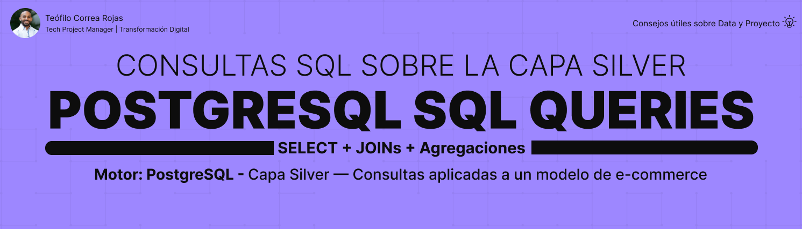

# PostgreSQL SQL Queries



## 📌 Descripción

Este proyecto tiene como objetivo practicar y documentar **consultas SQL**
sobre la capa Silver de una arquitectura Medallion en PostgreSQL,
aplicadas a un modelo de e-commerce real construido en proyectos anteriores.

El enfoque es práctico: cada consulta responde una pregunta de negocio
concreta, aplicando SELECT, JOINs y agregaciones sobre datos limpios
y validados.

---

## 🎯 Objetivos del proyecto

- Practicar SELECT con filtros WHERE, ORDER BY y LIMIT
- Aplicar INNER JOIN entre múltiples tablas relacionadas
- Construir agregaciones con COUNT, SUM y GROUP BY
- Responder preguntas de negocio reales sobre el modelo
- Fortalecer el razonamiento analítico detrás de cada consulta
- Documentar el propósito de cada script con un encabezado claro

---

## 🏗️ Contexto — Capa Silver

```
Arquitectura Medallion

│

├── STG     ← Proyecto 2

├── Bronze  ← Proyecto 3

├── Silver  ← Proyecto 4 — fuente de estas consultas

└── Gold    ← Proyecto 6
```

Todas las consultas de este proyecto se ejecutan sobre la capa Silver,
ya que es la capa con datos limpios, validados y con relaciones FK
formales — la base ideal para hacer análisis confiable.

---

## 🧱 Estructura del proyecto

```
PostgreSQL_SQL_Queries/

│

├── asset/

│   └── table_design_SQL_queries.png

│

├── docs/

│   └── project_closure.md

│

├── sql/

│   ├── 01_select_basico/

│   │   ├── 01_clientes_activos.sql

│   │   ├── 02_productos_por_precio.sql

│   │   ├── 03_ordenes_pendientes.sql

│   │   └── 04_empleados_activos.sql

│   │

│   ├── 02_joins/

│   │   ├── 01_clientes_con_ordenes.sql

│   │   ├── 02_productos_con_categorias.sql

│   │   ├── 03_ordenes_con_empleados.sql

│   │   └── 04_detalle_completo_orden.sql

│   │

│   ├── 03_agregaciones/

│   │   ├── 01_ventas_por_cliente.sql

│   │   ├── 02_productos_mas_vendidos.sql

│   │   ├── 03_rendimiento_empleados.sql

│   │   └── 04_ordenes_por_estado.sql

│   │

│   └── 04_subconsultas/

│       └── (pausado — ver nota abajo)

│

├── .gitignore

└── README.md
```

---

## 📊 Consultas completadas

| Bloque | Consultas | Estado |
|---|---|---|
| SELECT Básico | 4 | ✅ Completado |
| JOINs | 4 | ✅ Completado |
| Agregaciones | 4 | ✅ Completado |
| Subconsultas | — | ⏸️ Pausado |

---

## ⏸️ Nota sobre Subconsultas

El bloque de **Subconsultas** se pausó intencionalmente para
completar primero un curso estructurado sobre el tema. Esto
garantiza una comprensión más sólida antes de aplicarlas aquí.

Este repositorio se actualizará cuando se complete el curso
correspondiente.

---

## 💡 Convenciones usadas

```sql
-- ============================================================
-- Script   : Nombre descriptivo de la consulta
-- Capa     : Silver
-- Objetivo : Qué pregunta de negocio responde
-- Autor    : Teofilo Correa Rojas
-- Fecha    : Junio 2026
-- ============================================================
```

```
Alias de tabla   → primera letra o abreviación (c, o, p, e)

Alias de campo   → AS snake_case descriptivo

JOIN             → siempre con ON, salvo mismo nombre de campo

WHERE            → solo cuando excluye valores reales

GROUP BY         → todo campo no agregado debe estar aquí
```

---

## 🔗 Proyectos relacionados

| # | Proyecto | Descripción |
|---|---|---|
| 1 | [PostgreSQL_Database_Infrastructure](https://github.com/teofilocorrea/PostgreSQL_Database_Infrastructure) | Base de datos y esquemas |
| 2 | [PostgreSQL_Table_Design](https://github.com/teofilocorrea/PostgreSQL_Table_Design) | STG Layer |
| 3 | [PostgreSQL_Bronze_Layer](https://github.com/teofilocorrea/PostgreSQL_Bronze_Layer) | Bronze Layer |
| 4 | [PostgreSQL_Silver_Layer](https://github.com/teofilocorrea/PostgreSQL_Silver_Layer) | Silver Layer |
| 5 | PostgreSQL_SQL_Queries | Consultas SQL ← estás aquí |
| 6 | PostgreSQL_Data_Modeling | Gold + Star Schema |

---

## 👤 Autor

### Teófilo Correa Rojas

**Tech Project Manager | Transformación Digital**

🔗 [LinkedIn](https://www.linkedin.com/in/teófilo-correa-rojas/)